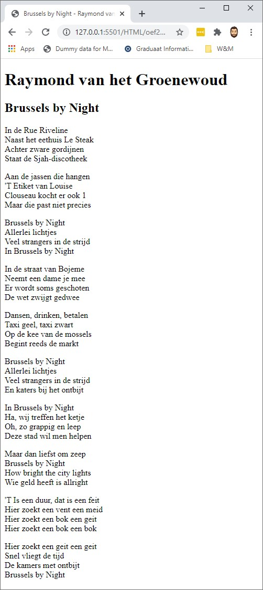

# Oefening

Maak een html pagina met een songtekst naar keuze.

Plaats elke strofe in een aparte paragraaf. Voorzie ook de nodige linebreaks binnen elke paragraaf.

Voorzie hierbij alle nodige tags.

## Voorbeeld

